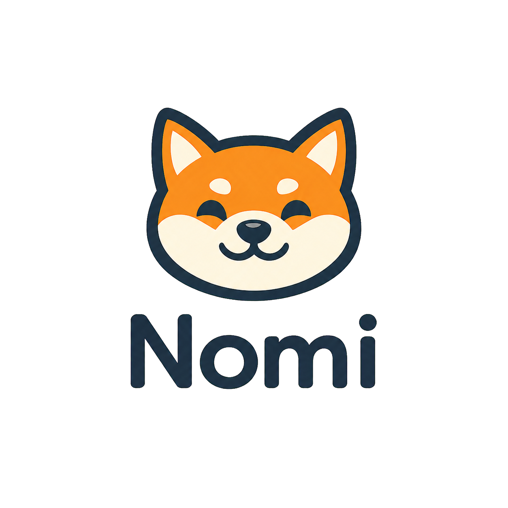
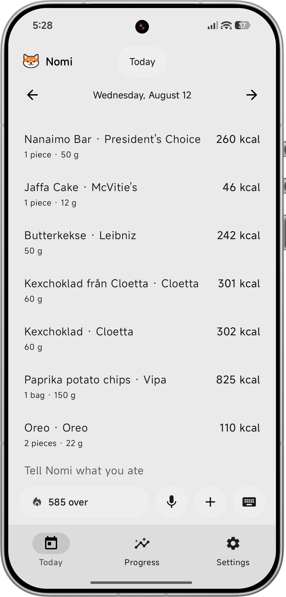
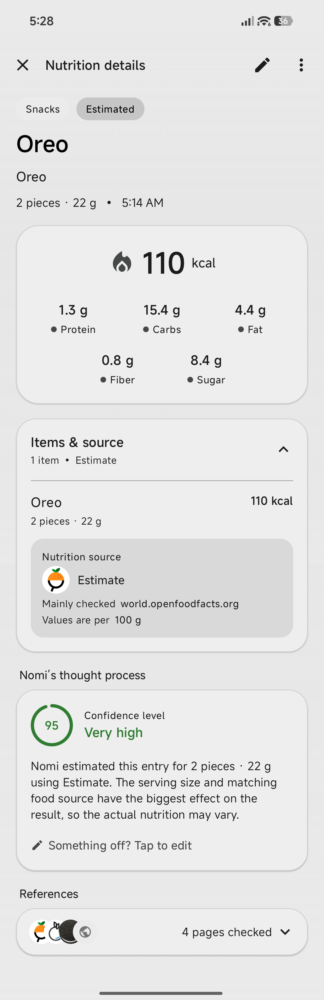
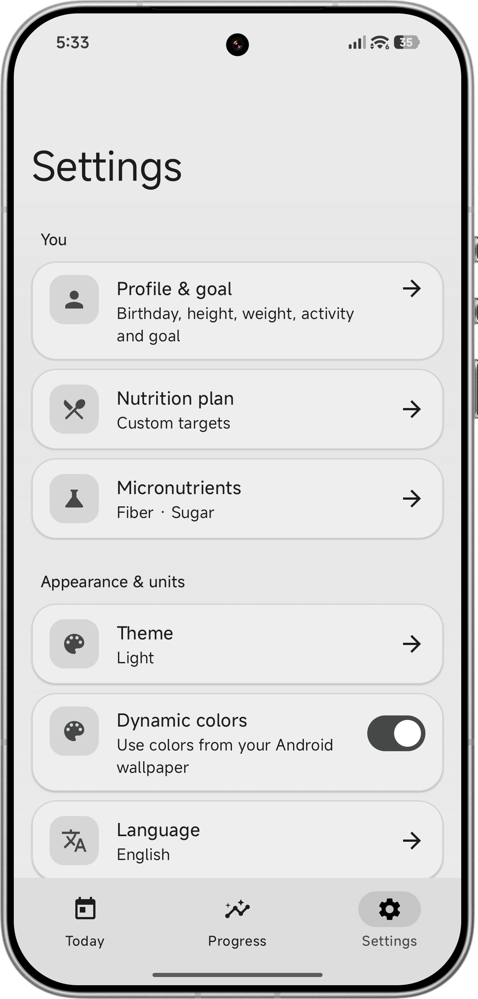

<div align="center">



### A fast Nutrition journal for Android

[](https://github.com/david-x3d/nomi/releases/tag/v1.3.5)
[](#requirements)
[](#-languages)
[](https://kotlinlang.org/)
[](#design)
[](LICENSE)

[Download the latest APK](https://github.com/david-x3d/nomi/releases/latest) · [Report a bug](https://github.com/david-x3d/nomi/issues)

</div>

> [!IMPORTANT]
> **Bring your own API key.** Nomi does not include hosted AI credits or a shared cloud account. AI-powered food research, interpretation, and image analysis require keys for the providers you choose in **Settings → AI providers**. Provider usage may incur charges on your own account.

## 📸 Screenshots

<!--
  Written as an explicit table with equal-width cells rather than a Markdown one. A Markdown
  table sizes its columns from the text in them, and GitHub's mobile app then scales each image
  to its own column, so the longer caption under one phone made the phone beside it render
  smaller. Fixed cell widths keep all three at the same scale.
-->
<table width="100%">
<tr align="center">
<td width="33%"><b>Today</b></td>
<td width="33%"><b>Nutrition details</b></td>
<td width="33%"><b>Settings</b></td>
</tr>
<tr align="center" valign="bottom">
<td width="33%"></td>
<td width="33%"></td>
<td width="33%"></td>
</tr>
<tr align="center" valign="top">
<td width="33%">Write a meal in plain language; every food lands as its own row.</td>
<td width="33%">Every number says where it came from and how sure Nomi is.</td>
<td width="33%">Ten languages, custom targets, and your own AI providers.</td>
</tr>
</table>

## ✨ Features

- 🗣️ Log food with natural language by typing or on-device dictation.
- 📷 Recognize meals and nutrition labels from photos.
- 🍽️ Scan full restaurant menus, search the extracted dishes, and select multiple items.
- 🔎 Research branded products and restaurant meals using configurable AI providers.
- ⚖️ Preserve explicit quantities and scale nutrition deterministically.
- ✏️ Correct a logged amount with phrases such as “I ate 60 g less” without repeating online research.
- ⭐ Reuse recent foods, favorites, and saved meals.
- 📊 Track calories, macros, micronutrients, weight, goals, and progress.
- 🌍 Use the app in ten languages with metric and US customary quantities.
- 🔐 Keep nutrition history local, with API keys protected by Android Keystore-backed encryption.

## 🌍 Languages

Nomi's interface is fully translated into ten languages. On first launch it follows your system language and falls back to English; you can switch at any time in **Settings → Language**, where each language is listed under its own name.

| Language | Code | Language | Code |
|---|---|---|---|
| English | `en` | Nederlands | `nl` |
| Deutsch | `de` | Português | `pt` |
| Español | `es` | Shqip | `sq` |
| Français | `fr` | Svenska | `sv` |
| Italiano | `it` | Türkçe | `tr` |

Food logging speaks the same languages: you can write or dictate a meal in any of them, and the AI keeps the food's own language in the logged name — “Rührei mit Speck”, “Pollo alla cacciatora”, “Beurre” — instead of translating it into English. Numbers, times, and dates are formatted for the selected language, and an amount typed with a comma (`1,5`) is understood everywhere.

## 🔑 AI setup

> [!TIP]
> **Recommended: Exa + Gemini.** Exa retrieves focused web evidence and Gemini turns those sources into structured nutrition data. A Gemini Flash Lite model is the recommended cost-conscious choice when it is available for your Google API project.

1. Install Nomi and open **Settings → AI providers**.
2. Select **Exa + Gemini** for food research, or choose another supported provider.
3. Enter your own Gemini and Exa API keys.
4. Tap **Test connection** before logging food.

Supported configurations include Sonar, Exa + Gemini, Perplexity, OpenRouter, OpenAI, and compatible custom endpoints. Exa + Gemini requires both a Google Gemini API key and an Exa API key. Only the text or image needed for the selected action is sent to the configured provider.

API keys are stored on the device, excluded from app backups, and never committed to this repository. Nomi cannot provide, recover, or pay for third-party API credentials.

## 📱 Installation

1. Open the [latest GitHub release](https://github.com/david-x3d/nomi/releases/latest).
2. Download the `Nomi-…-release.apk` asset.
3. Allow installation from your browser or file manager when Android asks.
4. Install the APK, then configure your own AI provider keys.

GitHub releases are the official distribution channel for this repository. Verify the SHA-256 digest shown by GitHub when integrity matters.

## 🎨 Design

Nomi is a native Jetpack Compose app built with Material 3 Expressive. It supports light, dark, dynamic-color, and pitch-black surfaces; spatial cards; responsive motion; edge-to-edge layouts; and phone/tablet navigation patterns.

## 🛡️ Privacy

- Nutrition history, saved meals, favorites, goals, and weight records are locally saved
- API credentials use Android Keystore-backed encryption and are excluded from exports and backups.
- Meal text or a selected image is sent only when an AI-powered action needs it.
- The configured provider's own privacy policy and pricing apply to those requests.
- Exported backups do not contain API keys or diagnostic events.

## 🧰 Requirements

| Purpose | Requirement |
|---|---|
| Install | Android 8.0 (API 26) or newer |
| Build | JDK 17 and Android SDK 37 |
| AI features | Your own supported provider API key(s) |

## 🏗️ Build from source

Windows:

```powershell
.\gradlew.bat :app:assembleDebug
```

macOS or Linux:

```bash
./gradlew :app:assembleDebug
```

The debug APK is written to `app/build/outputs/apk/debug/app-debug.apk`.

Run unit tests with:

```powershell
.\gradlew.bat :app:testDebugUnitTest
```

The optional nutrition evaluation tools live in `eval/`. Place live-evaluation credentials in `eval/.env`, which is ignored by Git, and run `python eval/run_eval.py --smoke` before a full `--live` evaluation.

## 🏷️ Versioning

Nomi follows semantic versioning for new releases:

- **Patch** (`1.2.0 → 1.2.1`): fixes, polish, and small performance improvements.
- **Minor** (`1.2.1 → 1.3.0`): substantial backward-compatible features or redesigns.
- **Major** (`1.x → 2.0.0`): incompatible storage, behavior, or platform changes.

Published historical tags are immutable so existing APK links and update paths remain valid. Release notes are maintained in English.

## 📄 License

Copyright © 2026 Nomi. All rights reserved. This is source-available proprietary software; no permission to copy, modify, redistribute, sublicense, or sell the software is granted. See [LICENSE](LICENSE) for the full notice.
